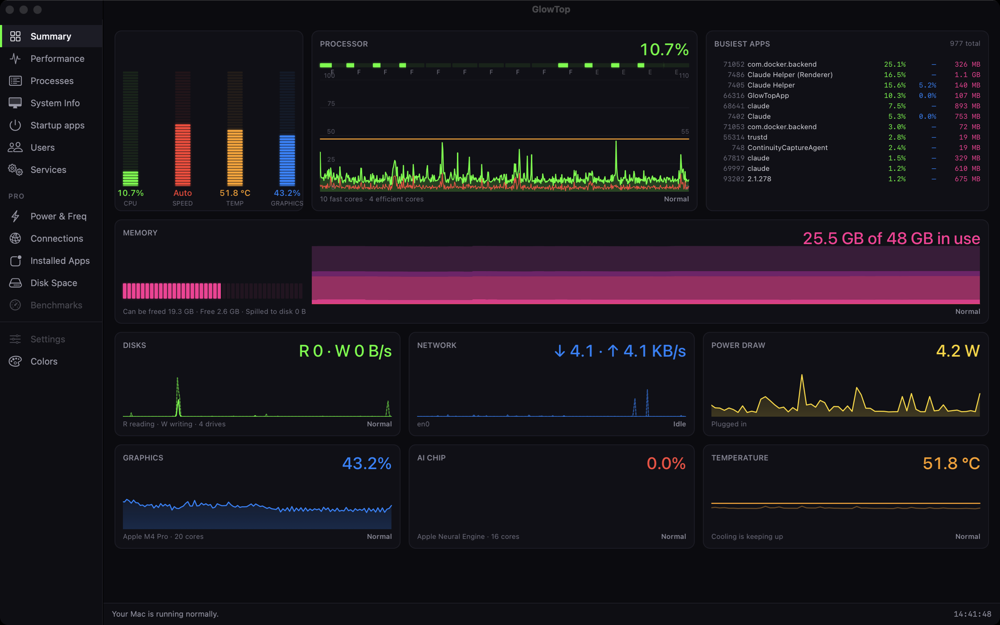
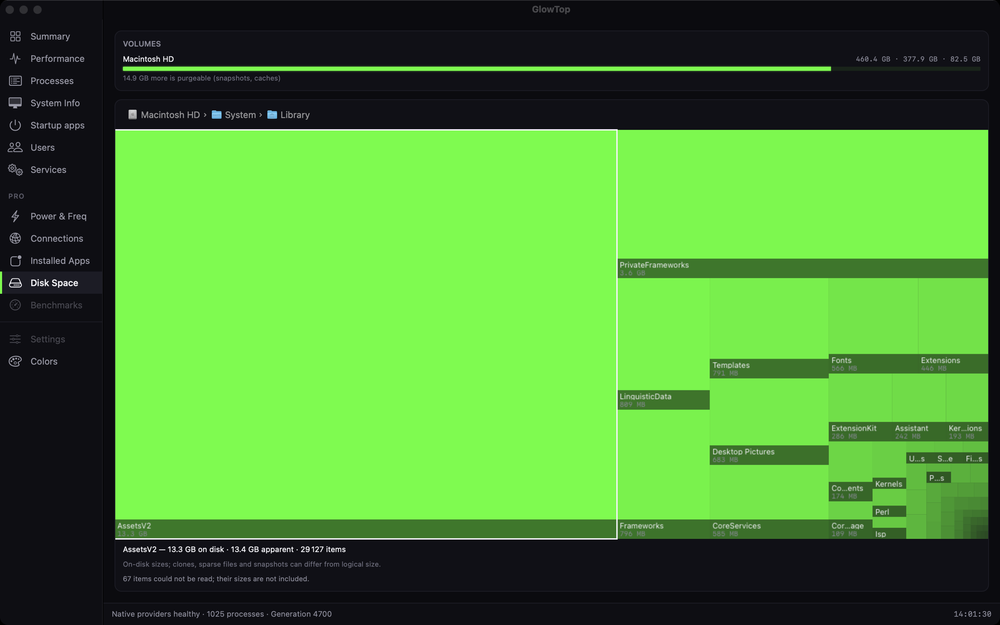

# GlowTop

A native macOS system monitor for Apple Silicon. The Summary dashboard shows per-core CPU meters, a CPU / temperature / kernel overlay chart, a top-process table, a memory timeline, and Disks / Network / Energy / GPU / NPU / Thermals tiles. Eleven more pages cover Performance, Processes, System Info, Startup apps, Users, Services, Power & Freq, Connections, Installed Apps, Disk Space (a drillable treemap) and Colors. Everything animates at the display's own refresh rate (120 fps on a ProMotion panel) on a near-black neon dashboard.



Written for people, not just engineers: the dashboard opens in **Simple mode**, where every card is labelled in plain words, most carry a one-word verdict (`Normal`, `Busy`, `Hot`, `Low on memory`), and each explains itself on hover, and the status bar says what your Mac is doing in a sentence. `View › Use Technical Labels` switches to the engineering names and numbers, unchanged.

**[Download the latest release](https://github.com/UsernameTron/glowtop/releases/latest)** · **[User guide](docs/USER-GUIDE.md)** (plain English, every page explained) · **[Report a problem](https://github.com/UsernameTron/glowtop/issues)**

Swift and SwiftUI with AppKit display-link views, SwiftPM, zero third-party dependencies. Signed with a Developer ID and notarized by Apple. Not sandboxed, and not on the App Store — see below for why.



## Requirements

- macOS 14 or later, Apple Silicon. There is no Intel build.

## Install

Download `GlowTop-<version>.dmg` and its `.sha256` file from the [releases page](https://github.com/UsernameTron/glowtop/releases/latest), open the DMG, and drag `GlowTop.app` onto the `Applications` link inside. The release build is notarized, so macOS opens it without a Gatekeeper refusal; you may still see the standard "downloaded from the Internet" confirmation the first time.

Verify the download before opening it, from the folder that holds both files:

```bash
shasum -a 256 -c GlowTop-1.2.0.dmg.sha256
```

## What it can see, and what it never does

- **It makes no network connections.** No update checks, no analytics, no crash reports. The Connections page reads the system's socket table; it never opens a socket or resolves a name. Every release is checked with `lsof` against the running app for this.
- **It never asks for your password or for root**, and it never runs `powermetrics` or any privileged helper.
- **It is deliberately not sandboxed.** The sandbox blocks the three calls the app is built around: listing every process (sandboxed, it would see only itself), reading other processes' CPU and memory, and quitting a process it does not own. That rules out the App Store; it is the only way this app can show what it shows.
- **Private APIs, read-only.** The GPU, NPU, Energy, Thermals and Frequency readings come from IOReport and IOKit, loaded with `dlopen` because Apple publishes no stable header for them. Every one of those readers fails safe: if an interface is unavailable on a given macOS release, its tile shows `—` instead of a wrong number or a crash. Set `GLOWTOP_DISABLE_PRIVATE=1` to force every private-sourced tile dark and confirm the rest of the app still runs at full frame rate.
- **Permissions.** GlowTop asks for no Full Disk Access and shows no permission prompt in normal use. The one exception is the Disk Space page: walking into a folder macOS protects can trigger a one-time system prompt. Denying it is safe — the folder renders as a locked node with no size shown.
- **Write actions.** The only things GlowTop can do to the running system are: quit a process, and enable or disable a Startup Apps entry or start or stop a Service — the last two only for jobs in your own `~/Library/LaunchAgents`, never system-wide or root-owned jobs. Each shows a confirmation sheet naming exactly what will happen, and every attempt, success or failure, is appended to `~/Library/Logs/GlowTop/actions.log`.

## Known limitations

- Sizing a large folder on the Disk Space page is throughput-bound by design: it reads every file beneath it, so a whole-disk walk takes minutes. It runs at utility priority so the rest of the app stays responsive, shows its progress, and can be stopped at any time with everything already measured kept.
- The macOS permission prompt for a protected folder has not been triggered on a live system; the locked-folder display it leads to is covered by unit tests and the app's automated self-check.
- `Benchmarks` and `Settings` appear greyed out in the sidebar: not in this version. The `PRO` heading in the sidebar is only a section label — there is no paid tier and no payment anything.

## Themes

The Colors page (sidebar, or `Colors › Edit Colors…`) has three presets — Neon, Classic Green, Amber Retro — and 22 editable color tokens with live apply, `Cmd-Z` to undo, and `Reset to preset`. The palette persists in `UserDefaults` under `com.glowtop.GlowTop`. To reset it from the command line:

```bash
defaults delete com.glowtop.GlowTop theme.presetName theme.customTokens theme.version
```

## Build from source

Needs **full Xcode** (verified with Xcode 27 / Swift 6.4; `Package.swift` declares tools version 5.10), not just the Command Line Tools — the SwiftUI macro plugin ships only with Xcode. After any Xcode update, accept its license first (`sudo xcodebuild -license accept`) or every `swift` command will refuse to run.

```bash
swift build                    # warning-free debug build
swift run GlowTopApp           # launch the app
swift run glowtop-probe cpu    # print live CPU samples as JSON lines
swift test                     # 416 unit tests; one skips unless GLOWTOP_DISABLE_PRIVATE=1
make run                       # release build, ad-hoc sign, install to ~/Applications, launch
scripts/package-app.sh --no-install   # build and sign without installing
```

A build you make yourself is ad-hoc signed and runs on your own Mac without any Gatekeeper step. If you copy an ad-hoc build to **another** Mac, macOS will refuse it; clear the quarantine flag there:

```bash
xattr -d com.apple.quarantine GlowTop.app
```

## How this was built

GlowTop was written spec-first with [Claude Code](https://claude.com/claude-code): a long written specification, [`SPEC.md`](SPEC.md), came before the code, every shipped feature traces to one of its sections, and each change had to pass a fixed set of checks ("gates" in the spec: warning-free build, tests, a no-network check, frame-rate and overhead budgets, a structural self-check of every rendered page, and cross-checks of each reading against `top`, `ps`, `vm_stat` and friends). [`CLAUDE.md`](CLAUDE.md) is the standing instruction file the assistant worked under. The day-to-day planning records are kept in a private archive; the spec's amendment log (§14.9) carries the history that matters.

## Inspiration and credit

The layout is modeled on TMOG, a closed-source macOS system monitor whose author described building it by feeding a long written specification to Claude Code. GlowTop is an independent implementation written from its own specification: it shares no code, assets or name with TMOG, and it is not affiliated with or endorsed by TMOG's author.

## Documentation

- [`docs/USER-GUIDE.md`](docs/USER-GUIDE.md) — plain-English guide to reading and using every page
- [`docs/release-notes-v1.2.0.md`](docs/release-notes-v1.2.0.md) — what is in the current release
- [`SPEC.md`](SPEC.md) — the full specification, 14 sections
- [`docs/BUILD-AND-RELEASE.md`](docs/BUILD-AND-RELEASE.md) — build, sign, notarize, verify
- [`docs/measurements/`](docs/measurements/) — raw measurement captures cited by the spec
- [`CLAUDE.md`](CLAUDE.md) — build commands, provider contract, layering and safety rules
- [`CONTRIBUTING.md`](CONTRIBUTING.md) · [`SECURITY.md`](SECURITY.md) · [`CHANGELOG.md`](CHANGELOG.md)

## License

MIT — see [LICENSE](LICENSE). Copyright (c) 2026 C Pete Connor.
